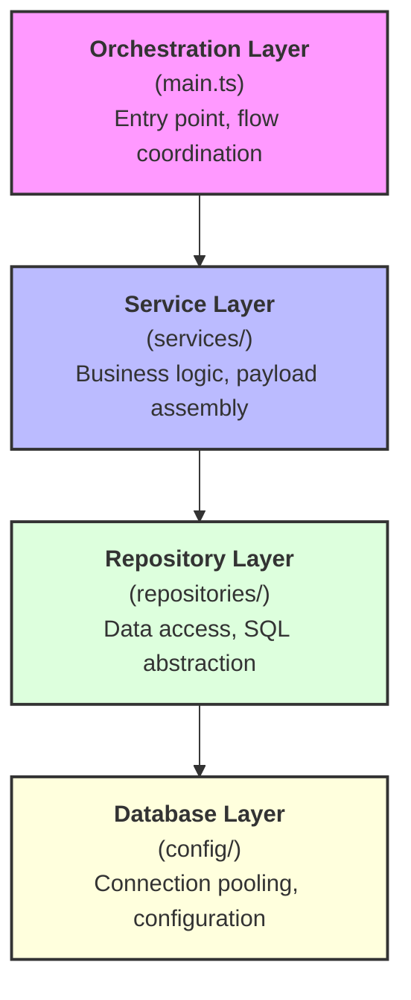

  <h1>Legacy Bridge: Node.js Integrator</h1>
  

  <strong>Connecting COBOL systems to modern Webhooks</strong> 
  Seamless integration between legacy ERP and cloud APIs

  
  
  

  <h2>About</h2>
  

    This project acts as a <b>bridge</b> between a <b>COBOL system</b> and the <b>F360 Webhook-PDV</b> (Tax Receipt Issuance). Its primary goal is to synchronize transaction values and payment methods efficiently.
  

  

    <b>The Problem</b>: Implementing complex JSON structures and asynchronous HTTP requests directly in COBOL proved to be a significant technical barrier.
  

  

    <b>The Solution</b>: We developed a robust middleware using <b>Node.js, TypeScript, and SQL Server</b>. This service orchestrates the data flow by generating the required JSON payloads, managing the webhook communication, and ensuring data integrity through an audit log table. By decoupling these responsibilities, the COBOL system only needs to trigger a <i>.bat</i> file, allowing the Node.js service to handle the modern web infrastructure.
  

## Architecture
This project follows a **layered architecture** with clear separation of concerns, inspired by **Clean Architecture** principles. The codebase is organized into distinct layers, each with well-defined responsibilities:

## Execution Flow

### 1. COBOL triggers a `.bat` file
### 2. Node.js service starts execution
### 3. Data is fetched via repositories
### 4. Payload is assembled in service layer
### 5. Webhook is sent to F360 API
### 6. Result is logged in audit table

## Design Patterns
### 1. Repository Pattern

Encapsulates all database access logic
Provides clean abstractions over raw SQL queries
Each repository handles a specific domain aggregate (FullcashRepository, PagamentoRepository, CnpjRepository)
Enables testability by isolating data access concerns

### 2. Dependency Injection (Constructor-Based)

All dependencies are injected via constructors
Promotes loose coupling and makes components independently testable
Example: WebhookService receives repository instances rather than creating them

### 3. Service Layer Pattern

Business logic is isolated in dedicated service classes
WebhookService orchestrates data retrieval and payload transformation
Keeps repositories free from business rules

### 4. Queue-Based Processing

Uses a database-backed queue (controle_envio_fullcash) for managing work items
Ensures transactional processing with audit trail
Atomic dequeue operation prevents duplicate processing

### 5. Audit Logging Pattern

Every processing attempt is logged to log_controle_envio_fullcash
Captures both success and failure states with descriptive messages
Enables historical tracking and debugging

## Tech Stack

### Runtime & Language
- Node.js (v18+): JavaScript runtime for executing TypeScript on the server
- TypeScript (v5+): Strongly-typed superset of JavaScript for improved developer experience and compile-time safety

### Database
- Microsoft SQL Server: Relational database hosting the COBOL system's transactional data
- mssql (v10+): Official SQL Server driver for Node.js with connection pooling and prepared statements

### HTTP Client
- Axios (v1+): Promise-based HTTP client for webhook communication with F360 API

### Configuration & Environment
- dotenv: Loads environment variables from .env files for configuration management

### Development Tools
- tsx: TypeScript execution engine for development and production builds

| Package | Purpose | Why This Choice |
| :--- | :--- | :---- |
| mssql | SQL Server connectivity | Official driver with TypeScript support, connection pooling, and transaction handling |
| axios | HTTP Request | Industry-standard, promise-based, handles errors gracefully |
| dotenv | Enviroment variables | Simple, zero-config solution for environment-based settings |
| typescript | Type safety | Catches errors at compile-time, improves IDE autocomplete, enforces contracts between layers |

## Getting Started

### Prerequisites
- Node.js (v20+ recommended)
- SQL Server instance

### Installation
1. Clone the repository: `git clone https://github.com/BAdeola/fullcash-360-webhook-bridge.git`
2. Install dependencies: `npm install`
3. Create a `.env` file based on `.env.example` and fill in your credentials.
4. Run the build: `npm run build`
5. Place the program in `C:/Fullcash-360_node` or update the path in the `.bat` file.
6. Execute the integration via the `.bat` file or `node dist/main.js`.

 
 

🌐 Language:
- 🇺🇸 English (default)
- 🇧🇷 [Português](./README.pt-BR.md)