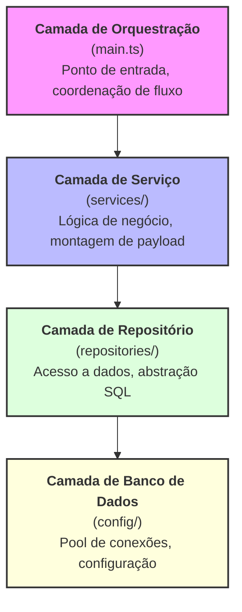

    <h1>Legacy Bridge: Integrador Node.js</h1>
    

    <strong>Conectando sistemas COBOL a Webhooks modernos</strong> 
    Integração fluida entre ERP legado e APIs na nuvem

    
    
    

    <h2>Sobre o Projeto</h2>
    

        Este projeto atua como uma <b>ponte</b> entre um <b>sistema COBOL</b> e o <b>Webhook-PDV da F360</b> (Emissão de Notas Fiscais). Seu objetivo principal é sincronizar valores de transação e métodos de pagamento de forma eficiente.
    

    

        <b>O Problema</b>: A implementação de estruturas JSON complexas e requisições HTTP assíncronas diretamente no COBOL representava uma barreira técnica significativa.
    

    

        <b>A Solução</b>: Desenvolvemos um middleware robusto utilizando <b>Node.js, TypeScript e SQL Server</b>. Este serviço orquestra o fluxo de dados gerando os payloads JSON necessários, gerenciando a comunicação com o webhook e garantindo a integridade dos dados através de uma tabela de logs de auditoria. Ao desacoplar essas responsabilidades, o sistema COBOL precisa apenas disparar um arquivo <i>.bat</i>, permitindo que o serviço Node.js lide com a infraestrutura web moderna.
    

## Arquitetura
Este projeto segue uma **arquitetura em camadas** com clara separação de preocupações, inspirada nos princípios da **Clean Architecture**. A base de código está organizada em camadas distintas, cada uma com responsabilidades bem definidas:

## Fluxo de Execução

### 1. COBOL dispara um arquivo .bat
### 2. Serviço Node.js inicia a execução
### 3. Dados são buscados via repositórios
### 4. Payload é montado na camada de serviço
### 5. Webhook é enviado para a API da F360
### 6. Resultado é registrado na tabela de auditoria

## Padrões de Projeto (Design Patterns)
### 1. Padrão de Repositório (Repository Pattern)

Encapsula toda a lógica de acesso ao banco de dados
Fornece abstrações limpas sobre consultas SQL puras 
Cada repositório lida com um agregado de domínio específico (FullcashRepository, PagamentoRepository, CnpjRepository)
facilitando os testes ao isolar as preocupações de dados

### 2. Injeção de Dependência (Baseada em Construtor)

Todas as dependências são injetadas via construtores.
Isso promove o baixo acoplamento e torna os componentes testáveis de forma independente.
Exemplo: O WebhookService recebe instâncias de repositórios em vez de criá-las internamente.

### 3. Padrão de Camada de Serviço (Service Layer Pattern)

A lógica de negócio é isolada em classes de serviço dedicadas.
O WebhookService orquestra a recuperação de dados e a transformação do payload,
mantendo os repositórios livres de regras de negócio.

### 4. Processamento Baseado em Fila

Utiliza uma fila baseada em banco de dados (controle_envio_fullcash) para gerenciar os itens de trabalho.
Garante o processamento transacional com trilha de auditoria.
A operação de "dequeue" atômica evita o processamento duplicado.

### 5. Padrão de Log de Auditoria

Cada tentativa de processamento é registrada em log_controle_envio_fullcash. 
Captura estados de sucesso e falha com mensagens descritivas, permitindo rastreamento histórico e depuração.

## Tecnologias Utilizadas

### Ambiente e Linguagem
- Node.js (v18+): Ambiente de execução JavaScript para rodar TypeScript no servidor.
- TypeScript (v5+): Superset de JavaScript com tipagem forte para melhor experiência de desenvolvimento e segurança em tempo de compilação.

### Banco de Dados
- Microsoft SQL Server: Banco de dados relacional que hospeda os dados transacionais do sistema COBOL.
- mssql (v10+): Driver oficial do SQL Server para Node.js com suporte a pool de conexões e prepared statements.

### Cliente HTTP
- Axios (v1+): Cliente HTTP baseado em Promises para comunicação via webhook com a API da F360.

### Configuração e Ambiente
- dotenv: Carrega variáveis de ambiente de arquivos .env para gerenciamento de configurações.

### Ferramentas de Desenvolvimento
- tsx: Mecanismo de execução TypeScript para builds de desenvolvimento e produção.

| Pacote | Propósito | Why This Choice |
| :--- | :--- | :---- |
| mssql | Conectividade SQL Server | Driver oficial com suporte a TypeScript, pool de conexões e manipulação de transações. |
| axios | Requisições HTTP | Padrão da indústria, baseado em Promises, lida com erros de forma elegante. |
| dotenv | Variáveis de Ambiente | Solução simples e com configuração zero para configurações baseadas em ambiente. |
| typescript | Segurança de Tipos | Captura erros em tempo de compilação, melhora o autocomplete da IDE e reforça contratos entre camadas. |

## Como Começar

### Pré-requisitos
- Node.js (v20+ recomendado)
- Instância do SQL Server

### Installation
1. Clone o repositório: `git clone https://github.com/BAdeola/fullcash-360-webhook-bridge.git`
2. Instale as dependências: `npm install`
3. Crie um arquivo `.env` baseado no `.env.example` e preencha com suas credenciais.
4. Rode a build: `npm run build`
5. Coloque o programa em `C:/Fullcash-360_node` ou ou atualize o caminho no arquivo `.bat`.
6. Execute a integração via arquivo `.bat` ou rode `node dist/main.js` dentro da pasta do projeto.

 
 

🌐 Língua:
- 🇧🇷 Português (default)
- us [Inglês](./README.en-us.md)